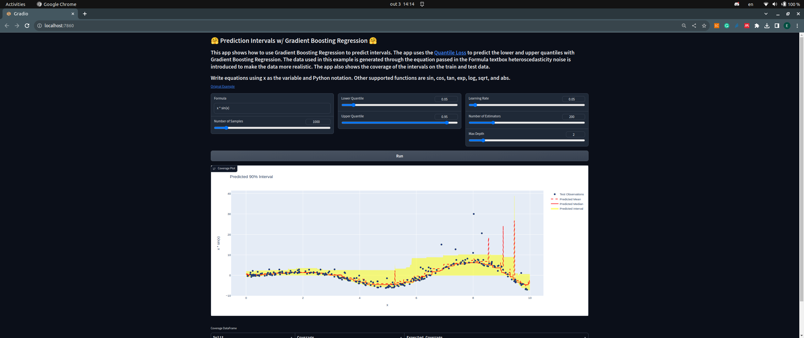

# hugging-face-sklearn-sprint
These are all my example contributions for Hugging Face Scikit-Learn docs sprint.

## Create Environment
Create a new conda environment with the following command:

```bash
conda env create -f env.yml
conda activate sklearn-docs
```

## Run Examples Locally

To run any example locally, you can use the following command:

```bash
gradio <example_directory>/app.py
```

and then access the app at `http://localhost:7860`.

For example running this command:

```bash
gradio Predictio-Intervals-for-Gradient-Boosting-Regression/app.py
```

and going to `http://localhost:7860` will show the following app:



## Examples on Hugging Face Spaces

All the examples are also hosted at Hugging Face Spaces under the [scikit-learn organization](https://huggingface.co/sklearn-docs). My examples can be found at the following links:

- [Prediction Intervals for Gradient Boosting Regression](https://huggingface.co/spaces/sklearn-docs/Predictio-Intervals-for-Gradient-Boosting-Regression)
- [Feature Transformations with ensembles of trees](https://huggingface.co/spaces/sklearn-docs/Feature-Transformations-with-Ensembles-of-Trees)
- [Hashing feature transformation using totally random trees](https://huggingface.co/spaces/sklearn-docs/Hashing-feature-transformation-using-Totally-Random-Trees)
- [Individual and Voting Regression Predictions](https://huggingface.co/spaces/sklearn-docs/Individual-and-Voting-Regression-Predictions)
- [Permutation Importance vs Random Forest Feature Importance](https://huggingface.co/spaces/sklearn-docs/Permutation-Importance-vs-Random-Forest-Feature-Importance)
- [Pipeline ANOVA SVM](https://huggingface.co/spaces/sklearn-docs/Pipeline-ANOVA-SVM)
- [Plotting Validation Curves](https://huggingface.co/spaces/sklearn-docs/Plotting-Validation-Curves)
- [Precission-Recall](https://huggingface.co/spaces/sklearn-docs/Precision-Recall?logs=build)
- [Statistical Comparision Grid Search](https://huggingface.co/spaces/sklearn-docs/Statistical-Comparison-Grid-Search)
- [SVM-Weighted-Samples](https://huggingface.co/spaces/sklearn-docs/SVM-Weighted-samples)
